# Fonts

The following font collections are supported.

 * [Amiga](#amiga)
 * [Atari](#atari)
 * [Commodore](#commodore)
 * [IBM](#ibm)
 * [Microsoft MSX](#microsoft-msx)
 * [Philips](#philips)
 * [Silicon Graphics](#silicon-graphics)
 * [Sinclair](#sinclair)
 * [Miscellanious Hobby Computers](#miscellanious-hobby-computers)
 * [Miscellanious](#miscellanious)
 * [Unkonwn](#unkonwn)

## Amiga

Example                                         | Name                  | Description                         
----------------------------------------------- | --------------------- | ------------------------------------
        | amiga-b-strict        | Amiga B-Strict                      
        | amiga-b-struct        | Amiga B-Struct                      
     | amiga-microknight     | dMG/t!s^dS! MicroKnight (modified)  
 | amiga-microknightplus | dMG/t!s^dS! MicroKnight (modified)  
         | amiga-mo-soul         | Desoto/Mo'Soul mO'sOul              
      | amiga-p0t-noodle      | Leo Davidson P0T-NOoDLE             
      | amiga-topaz-a500      | Amiga Topaz Kickstart 1.x           
     | amiga-topaz-a1200     | Amiga Topaz Kickstart 2.x           
  | amiga-topazplus-a500  | Amiga Topaz Kickstart 1.x (modified)
 | amiga-topazplus-a1200 | Amiga Topaz Kickstart 2.x (modified)

## Atari

Example                                              | Name                       | Description                
---------------------------------------------------- | -------------------------- | ---------------------------
        | atascii-arabic-8x16        | ATARI ASCII (Arabic)       
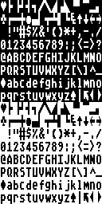      | atascii-graphics-8x16      | ATARI ASCII (Graphics)     
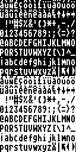 | atascii-international-8x16 | ATARI ASCII (International)

## Commodore

Example                                        | Name                 | Description                             
---------------------------------------------- | -------------------- | ----------------------------------------
             | c128-8x8             | Commodore 128                           
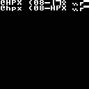              | c16-8x8              | Commodore 16                            
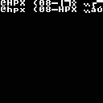    | c16-hungarian-8x8    | Commodore 16 (Hungarian)                
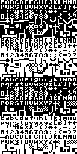              | c64-8x8              | Commodore 64                            
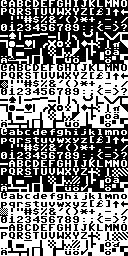       | c64-german-8x8       | Commodore 64 (German)                   
    | c64-hungarian-8x8    | Commodore 64 (Hungarian)                
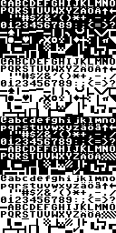      | c64-swedish-8x8      | Commodore 64 (Swedish)                  
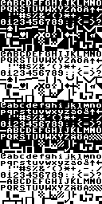     | c64-swedish2-8x8     | Commodore 64 (Swedish alternative)      
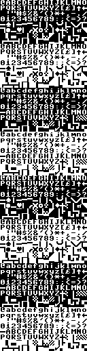         | c65-caff-8x8         | Commodore 65                            
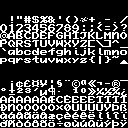            | giana-8x8            | Commodore 64 Giana Sisters              
            | pet-1-8x8            | Commodore PET 2001 series               
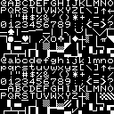            | pet-2-8x8            | Commodore PET 4000 series               
        | pet-greek-8x8        | Commodore PET 2001 series (Greek)       
    | pet-norwegian-8x8    | Commodore PET 2001 series (Norwegian)   
      | pet-russian-8x8      | Commodore PET 2001 series (Russian)     
      | pet-swedish-8x8      | Commodore PET 2001 series (Swedish)     
         | superpet-8x8         | Commodore SuperPET 9000 series          
 | superpet-swedish-8x8 | Commodore SuperPET 9000 series (Swedish)
            | vic20-8x8            | Commodore VIC-20                        
     | vic20-german-8x8     | Commodore VIC-20/VC-20 (German)         
   | vic20-japanese-8x8   | Commodore VIC-20/VIC-1001 (Japanese)    
  | vic20-norwegian-8x8  | Commodore VIC-20 (Norwegian)            
    | vic20-swedish-8x8    | Commodore VIC-20 (Swedish)              

## IBM

Example                                       | Name                | Description                          
--------------------------------------------- | ------------------- | -------------------------------------
      | ibm-cp437-8x14      | IBM PC Code Page 437 (US Latin)      
      | ibm-cp437-8x16      | IBM PC Code Page 437 (US Latin)      
       | ibm-cp437-8x8       | IBM PC Code Page 437 (US Latin)      
 | ibm-cp437-thin-8x16 | IBM PC Code Page 437 (US Latin, thin)
  | ibm-cp437-thin-8x8  | IBM PC Code Page 437 (US Latin, thin)
      | ibm-cp737-8x16      | IBM PC Code Page 737 (Greek)         
      | ibm-cp775-8x16      | IBM PC Code Page 775 (Baltic Rim)    
      | ibm-cp850-8x14      | IBM PC Code Page 850 (Latin 1)       
      | ibm-cp850-8x16      | IBM PC Code Page 850 (Latin 1)       
       | ibm-cp850-8x8       | IBM PC Code Page 850 (Latin 1)       
 | ibm-cp850-thin-8x16 | IBM PC Code Page 850 (Latin 1, thin) 
  | ibm-cp850-thin-8x8  | IBM PC Code Page 850 (Latin 1, thin) 
      | ibm-cp852-8x16      | IBM PC Code Page 852 (Latin 2)       
      | ibm-cp855-8x16      | IBM PC Code Page 855 (Cyrillic)      
      | ibm-cp857-8x16      | IBM PC Code Page 857 (Turkish)       
      | ibm-cp860-8x16      | IBM PC Code Page 860 (Portuguese)    
      | ibm-cp861-8x16      | IBM PC Code Page 861 (Icelandic)     
      | ibm-cp862-8x16      | IBM PC Code Page 862 (Hebrew)        
      | ibm-cp863-8x16      | IBM PC Code Page 863 (French Canada) 
      | ibm-cp865-8x14      | IBM PC Code Page 865 (Nordic)        
      | ibm-cp865-8x16      | IBM PC Code Page 865 (Nordic)        
       | ibm-cp865-8x8       | IBM PC Code Page 865 (Nordic)        
 | ibm-cp865-thin-8x16 | IBM PC Code Page 865 (Nordic, thin)  
  | ibm-cp865-thin-8x8  | IBM PC Code Page 865 (Nordic, thin)  
      | ibm-cp866-8x14      | IBM PC Code Page 866 (Cyrillic CIS 1)
      | ibm-cp866-8x16      | IBM PC Code Page 866 (Cyrillic CIS 1)
       | ibm-cp866-8x8       | IBM PC Code Page 866 (Cyrillic CIS 1)
     | ibm-cp866b-8x16     | IBM PC Code Page 866 (Bulgarian)     
     | ibm-cp866c-8x16     | IBM PC Code Page 866 (Russian)       
     | ibm-cp866u-8x14     | IBM PC Code Page 866 (Ukrainian)     
     | ibm-cp866u-8x16     | IBM PC Code Page 866 (Ukrainian)     
      | ibm-cp866u-8x8      | IBM PC Code Page 866 (Ukrainian)     
      | ibm-cp869-8x16      | IBM PC Code Page 869 (Greek 2)       
     | ibm-cp1251-8x14     | IBM PC Code Page 1251 (Slavic)       
     | ibm-cp1251-8x16     | IBM PC Code Page 1251 (Slavic)       
      | ibm-cp1251-8x8      | IBM PC Code Page 1251 (Slavic)       

## Microsoft MSX

Example                                     | Name              | Description              
------------------------------------------- | ----------------- | -------------------------
 | msx-brazilian-8x8 | Microsoft MSX (Brazilian)
  | msx-cyrillic-8x8  | Microsoft MSX (Cyrillic) 

## Philips

Example                                        | Name                 | Description    
---------------------------------------------- | -------------------- | ---------------
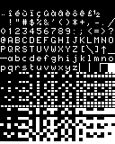 | philips-vg-5000-8x10 | Philips VG 5000

## Silicon Graphics

Example                                      | Name               | Description               
-------------------------------------------- | ------------------ | --------------------------
 | sgi-iris-3130-8x16 | Silicon Graphics IRIS 3000
   | sgi-iris-4d-8x16   | Silicon Grpahics IRIS 4D  

## Sinclair

Example                                    | Name             | Description                  
------------------------------------------ | ---------------- | -----------------------------
    | sam-coupe-8x8    | SAM Coupé (ZX Spectrum clone)
        | zx-81-8x8        | Sinclair ZX81                
 | zx-evolution-8x8 | Vitality ZX Evolution        
  | zx-spectrum-8x8  | Sinclair ZX Spectrum         

## Miscellanious Hobby Computers

Example                                  | Name           | Description           
---------------------------------------- | -------------- | ----------------------
   | aquarius-8x8   | Aquarius Home Computer
 | galaksija-8x13 | Galaksija (Galaxy)    
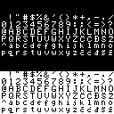       | orao-8x8       | Orao (Eagle)          

## Miscellanious

Example                                       | Name                | Description    
--------------------------------------------- | ------------------- | ---------------
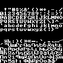        | armscii8-8x8        | ARMSCII        
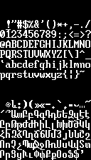       | armscii8-8x14       | ARMSCII        
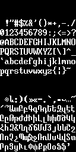       | armscii8-8x16       | ARMSCII        
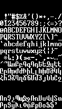          | haik8-8x14          | ARMSCII (haik8)
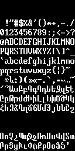          | haik8-8x16          | ARMSCII (haik8)
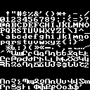           | haik8-8x8           | ARMSCII        
 | hitachi-mb-6880-8x8 | Hitachi MB 6880

## Unkonwn

Example                                        | Name                 | Description
---------------------------------------------- | -------------------- | -------
           | iso02-8x14           | Unknown
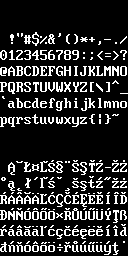           | iso02-8x16           | Unknown
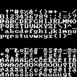            | iso02-8x8            | Unknown
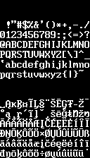           | iso04-8x14           | Unknown
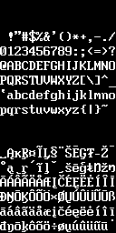           | iso04-8x16           | Unknown
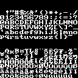            | iso04-8x8            | Unknown
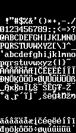      | iso04-vga9-8x14      | Unknown
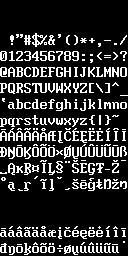      | iso04-vga9-8x16      | Unknown
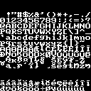       | iso04-vga9-8x8       | Unknown
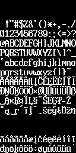 | iso04-vga9-wide-8x16 | Unknown
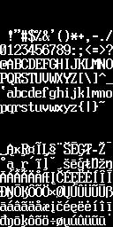      | iso04-wide-8x16      | Unknown
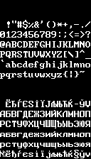           | iso05-8x14           | Unknown
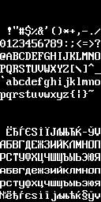           | iso05-8x16           | Unknown
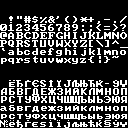            | iso05-8x8            | Unknown
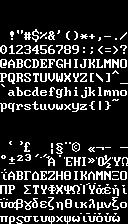           | iso07-8x14           | Unknown
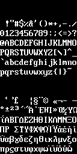           | iso07-8x16           | Unknown
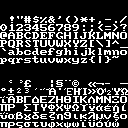            | iso07-8x8            | Unknown
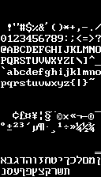           | iso08-8x14           | Unknown
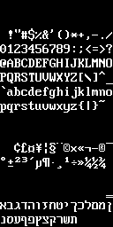           | iso08-8x16           | Unknown
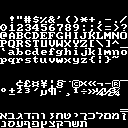            | iso08-8x8            | Unknown
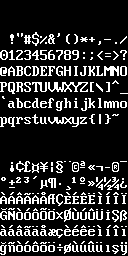           | iso09-8x16           | Unknown
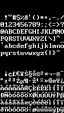           | iso15-8x14           | Unknown
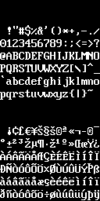           | iso15-8x16           | Unknown
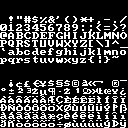            | iso15-8x8            | Unknown
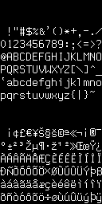      | iso15-thin-8x16      | Unknown
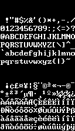             | iso-8x14             | Unknown
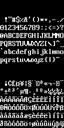             | iso-8x16             | Unknown
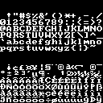              | iso-8x8              | Unknown
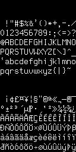        | iso-thin-8x16        | Unknown
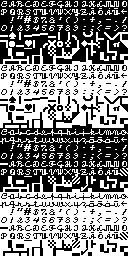            | kauno-8x8            | Unknown
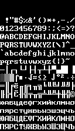          | koi8-r-8x14          | Unknown
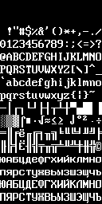          | koi8-r-8x16          | Unknown
           | koi8-r-8x8           | Unknown
         | koi8-rb-8x16         | Unknown
         | koi8-rc-8x16         | Unknown
          | koi8-u-8x14          | Unknown
          | koi8-u-8x16          | Unknown
           | koi8-u-8x8           | Unknown
      | swiss-1131-8x16      | Unknown
      | swiss-1251-8x16      | Unknown
           | swiss-8x14           | Unknown
           | swiss-8x16           | Unknown
            | swiss-8x8            | Unknown

