# Supported pixel fonts

## MS-DOS ("OEM") fonts

Font                  | Description           | Sizes
--------------------- | --------------------- | -------------------------------
cp437                 | MS-DOS Latin US       | [8x8](docs/font/cp437_8x8.png) [thin_8x8](docs/font/cp437_thin_8x8.png) [8x14](docs/font/cp437_8x14.png) [8x16](docs/font/cp437_8x16.png) [thin_8x16](docs/font/cp437_thin_8x16.png)
cp737                 | MS-DOS Greek          | [8x16](docs/font/cp737_8x16.png)
cp775                 | MS-DOS Baltic Rim     | [8x16](docs/font/cp775_8x16.png)
cp850                 | MS-DOS Latin 1        | [8x8](docs/font/cp850_8x8.png) [8x14](docs/font/cp850_8x14.png) [8x16](docs/font/cp850_8x16.png) [thin_8x8](docs/font/cp850_thin_8x8.png) [thin_8x16](docs/font/cp850_thin_8x16.png)
cp852                 | MS-DOS Latin 2        | [8x16](docs/font/cp852_8x16.png) 
cp855                 | MS-DOS Cyrillic       | [8x16](docs/font/cp855_8x16.png) 
cp857                 | MS-DOS Turkish        | [8x16](docs/font/cp857_8x16.png) 
cp860                 | MS-DOS Portuguese     | [8x16](docs/font/cp860_8x16.png) 
cp861                 | MS-DOS Icelandic      | [8x16](docs/font/cp861_8x16.png) 
cp862                 | MS-DOS Hebrew         | [8x16](docs/font/cp862_8x16.png) 
cp863                 | MS-DOS French Canada  | [8x16](docs/font/cp863_8x16.png) 
cp865                 | MS-DOS Nordic         | [8x8](docs/font/cp865_8x8.png) [8x14](docs/font/cp865_8x14.png) [8x16](docs/font/cp865_8x16.png) [thin_8x8](docs/font/cp865_thin_8x8.png) [thin_8x16](docs/font/cp865_thin_8x16.png) 
cp866                 | MS-DOS Cyrillic CIS 1 | [8x8](docs/font/cp866_8x8.png) [8x14](docs/font/cp866_8x14.png) [8x16](docs/font/cp866_8x16.png) 
cp866b                | MS-DOS Bulgarian      | [8x16](docs/font/cp866b_8x16.png) 
cp866c                | MS-DOS Russian        | [8x16](docs/font/cp866c_8x16.png) 
cp866u                | MS-DOS Ukrainian      | [8x8](docs/font/cp866u_8x8.png) [8x14](docs/font/cp866u_8x14.png) [8x16](docs/font/cp866u_8x16.png) 
cp869                 | MS-DOS Greek 2        | [8x16](docs/font/cp869_8x16.png) 
cp1251                | MS-DOS Slavic         | [8x8](docs/font/cp1251_8x8.png) [8x14](docs/font/cp1251_8x14.png) [8x16](docs/font/cp1251_8x16.png) 

## Amiga fonts

Font                  | Description                        | Sizes
--------------------- | ---------------------------------- | ------------------
b_strict              | Amiga B-Strict                     | [8x8](docs/font/b_strict.png)
b_struct              | Amiga B-Strict                     | [8x8](docs/font/b_struct.png)
microknight           | Amiga MicroKnight                  | [8x16](docs/font/microknight.png)
microknight_plus      | Amiga MicroKnight enhanced version | [8x16](docs/font/microknightplus.png)
mo_soul               | Amiga mO'sOul                      | [8x16](docs/font/mo_soul.png)
p0t_noodle            | Amiga P0T-NOoDLE                   | [8x16](docs/font/p0t_noodle.png)
topaz_a500            | Amiga Topaz 1 (A500, A1000, A2000) | [8x16](docs/font/topaz_a500.png)
topazplus_a500        | Amiga Topaz 1 enhanced version     | [8x16](docs/font/topazplus_a500.png)
topaz_a1200           | Amiga Topaz 2 (A600, A1200, A4000) | [8x16](docs/font/topaz_a1200.png)
topazplus_a1200       | Amiga Topaz 2 enhanced version     | [8x16](docs/font/topazplus_a1200.png)

## Atari fonts

Font                  | Description                 | Sizes
--------------------- | --------------------------- | ------------------------
atascii_arabic        | Atari ATASCII Arabic        | [8x16](docs/font/atascii_arabic_8x16.png)
atascii_graphics      | Atari ATASCII Graphics      | [8x16](docs/font/atascii_graphics_8x16.png)
atascii_international | Atari ATASCII International | [8x16](docs/font/atascii_international_8x16.png)

## Commodore fonts

Font                  | Description                      | Example
--------------------- | -------------------------------- | -------------------
pet-1-8x8             | Commodore PET 1                  | 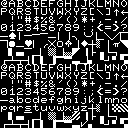
pet-2-8x8             | Commodore PET 2                  | 
pet-greek-8x8         | Commodore PET (Greek)            | 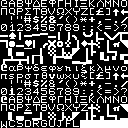
pet-norwegian-8x8     | Commodore PET (Norwegian)        | 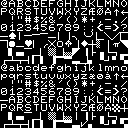
pet-russian-8x8       | Commodore PET (Russian)          | 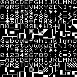
pet-swedish-8x8       | Commodore PET (Swedish)          | 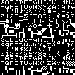
superpet-8x8          | Commodore SuperPET 9000          | 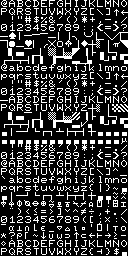
superpet-swedish-8x8  | Commodore SuperPET 9000 (Swedish)| 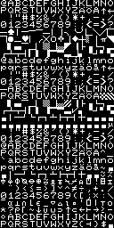
vic20-8x8             | Commodore VIC-20                 | 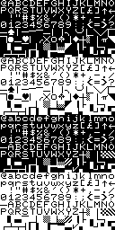
vic20-german-8x8      | Commodore VIC-20 (German)        | 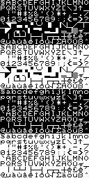
vic20-japanese-8x8    | Commodore VIC-20 (Japanese)      | 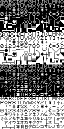
vic20-norwegian-8x8   | Commodore VIC-20 (Norwegian)     | 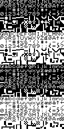
vic20-swedish-8x8     | Commodore VIC-20 (Swedish)       | 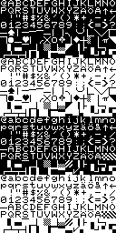

## Microsoft MSX

Font                  | Description               | Example
--------------------- | ------------------------- | --------------------------
msx-brazilian-8x8     | MSX (Brazilian)           | 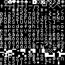
msx-cyrillic-8x8      | MSX (Cyrillic)            | 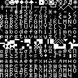

## Silicon Graphics fonts

Font                  | Description               | Example
--------------------- | ------------------------- | --------------------------
sgi-iris-3130-8x16    | SGI IRIS 3000             | 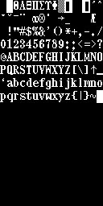
sgi-iris-4d-8x16      | SGI IRIS 4D               | 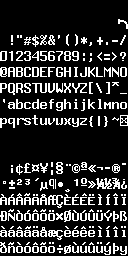

## Sinclair fonts

Font                  | Description               | Example
--------------------- | ------------------------- | --------------------------
sam-coupe-8x8         | SAM Coupé (clone)         | 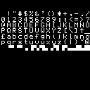
zx-81                 | Sinclair ZX81             | 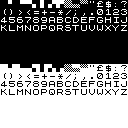
zx-evolution-8x8      | Vitality ZX Evolution     | 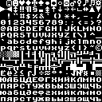
zx-spectrum-8x8       | Sinclair ZX Spectrum      | 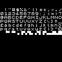

## Miscellanious hobby computer fonts

Font                  | Description               | Example
--------------------- | ------------------------- | --------------------------
galaksija-8x13        | Galaksija (Galaxy)        | 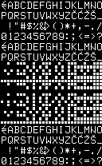
orao-8x8              | Oraa (Eagle)              | 

## Miscellanious fonts

Font                  | Description               | Example
--------------------- | ------------------------- | --------------------------
aquarius-8x8          | Aquarius Home Computer    | 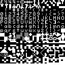
armscii8              | Armenian ASCII (ARMSCII)  | [8x8](docs/font/armscii8_8x8.png) [8x14](docs/font/armscii8_8x14.png) [8x16](docs/font/armscii8_8x16.png) 
haik8                 | haik8 code page (ARMSCII) | [8x8](docs/font/haik8_8x8.png) [8x14](docs/font/haik8_8x14.png) [8x16](docs/font/haik8_8x16.png) 
hitachi-mb-6880-8x8   | Hitachi Basic Master      | 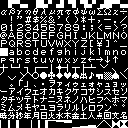
iso                   | West European             | [8x8](docs/font/iso_8x8.png) [8x14](docs/font/iso_8x14.png) [8x16](docs/font/iso_8x16.png) [thin_8x16](docs/font/iso_thin_8x16.png) 
iso02                 | Central European          | [8x8](docs/font/iso02_8x8.png) [8x14](docs/font/iso02_8x14.png) [8x16](docs/font/iso02_8x16.png)  
iso04                 | Baltic                    | [8x8](docs/font/iso04_8x8.png) [8x14](docs/font/iso04_8x14.png) [8x16](docs/font/iso04_8x16.png)
iso05                 | Cyrillic                  | [8x8](docs/font/iso05_8x8.png) [8x14](docs/font/iso05_8x14.png) [8x16](docs/font/iso05_8x16.png) 
iso07                 | Greek                     | [8x8](docs/font/iso07_8x8.png) [8x14](docs/font/iso07_8x14.png) [8x16](docs/font/iso07_8x16.png) 
iso08                 | Hebrew                    | [8x8](docs/font/iso08_8x8.png) [8x14](docs/font/iso08_8x14.png) [8x16](docs/font/iso08_8x16.png) 
iso09                 | Turkish                   | [8x16](docs/font/iso09_8x16.png) 
iso15                 | West European             | [8x8](docs/font/iso15_8x8.png) [8x14](docs/font/iso15_8x14.png) [8x16](docs/font/iso15_8x16.png) [thin_8x16](docs/font/iso15_thin_8x16.png) 
koi8_r                | Russian                   | [8x14](docs/font/koi8_r_8x14.png) [8x16](docs/font/koi8_r_8x16.png) [8x8](docs/font/koi8_r_8x8.png)
koi8_rb               | Russian                   | [8x16](docs/font/koi8_rb_8x16.png)
koi8_rc               | Russian                   | [8x16](docs/font/koi8_rc_8x16.png)
koi8_u                | Ukrainian                 | [8x8](docs/font/koi8_u_8x8.png) [8x14](docs/font/koi8_u_8x14.png) [8x16](docs/font/koi8_u_8x16.png)
swiss                 | ?                         | [8x8](docs/font/swiss_8x8.png) [8x14](docs/font/swiss_8x14.png) [8x16](docs/font/swiss_8x16.png) 
swiss_1131            | Belarusian                | [8x16](docs/font/swiss_1131_8x16.png)
swiss_1251            | Cyrillic                  | [8x16](docs/font/swiss_1251_8x16.png)
