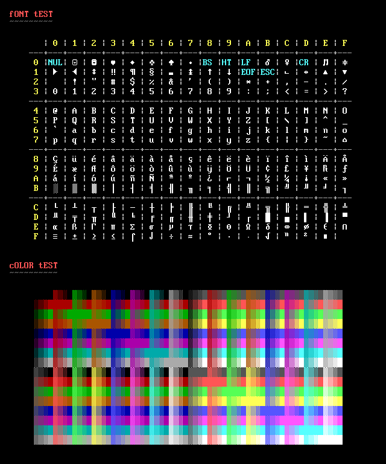
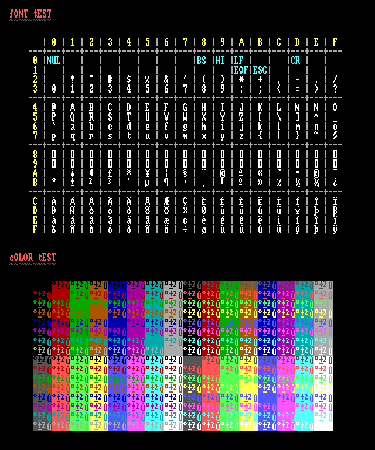

# piece-c

Fast, feature-rich Artscene render engine


# Example

```shell
$ piece -o docs/demo/demo.png docs/demo/test.ans
```

And the resulting image:



We can also request `piece` to use an Amiga font:

```shell
$ piece -f amiga -o docs/demo/amiga.png docs/demo/test.ans
```

Resulting in:



# Features

## Supported file formats

* ANSi (.ans), mostly [ECMA-048](http://www.ecma-international.org/publications/standards/Ecma-048.htm) compliant
* ASCII (.asc, .diz)
* Artworx (.adf)
* BIN (.bin)
* iCE Draw (.idf)
* PCBoard (.pcb)
* RIPScript (.rip, TODO)
* TundraDraw (.tnd)
* XBIN (.xb), fully [Acid XBIN](http://www.acid.org/info/xbin/xbin.htm) compliant


## Supported pixel fonts

Please check the [list of supported fonts](FONTS.md).

## Supported output formats

* Text (plain text)
* Image (bmp, gif, jpeg, png)

## Supported dynamic languages

*These extensions are highly experimental and subject to change*

* [Perl](http://www.perl.org/) version 5.6 and up, see
  the [piece-perl](https://github.com/bbsninja/piece-perl) project
* [Python](http://www.python.org/) version 2.6 and 2.7, see
  the [piece-python](https://github.com/bbsninja/piece-python) project


# Requirements

You need the following to compile ``piece``:

* [libgd](http://libgd.bitbucket.org/)
* [Scons](http://www.scons.org/)
* [Python](http://python.org/)


# Building

First inspect the build options, by running:

```shellsession
$ scons --help
```

To compile everything from source:

```shellsession
$ scons
```

To clean the build root:

```shellsession
$ scons -c
```

## Building the Python extension

To build the Python extension, make sure you have the Python development
headers installed.

On a Debian/Ubuntu based system:

```shellsession
$ sudo apt-get install python-dev
```

On a Red Hat/RPM based system:

```shellsession
$ sudo yum install python-devel
```

To build the extension:

```
$ scons --with-python
```


# Installing

To install everything into ``/usr/local``:

```shellsession
$ sudo scons install
```


# Uninstalling

To remove the ``piece`` installation:

```shellsession
$ sudo scons uninstall
```


# Acknowledgements

Inspired by the [Ansilove](http://ansilove.sourceforge.net/) ANSi to PNG
converter, the first version of ``piece`` was written in Python. Because we
required more speed, the Python version was ported to pure C and lots of
features and font sets were added.

The fonts found in the [fnt](/src/piece/font/fnt/) folder, are part of the
FreeBSD [newcons](https://wiki.freebsd.org/Newcons) project and BSD licensed.
